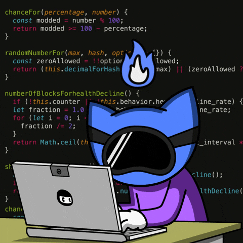

<!-- Developer Banner -->

<!-- Typing Intro -->

  

---

  

<h1 align="center">⚡ Jittu Rao ⚡</h1>
<h3 align="center">A passionate developer and tech enthusiast</h3>

## 🌩️ About Me

  

    <h3 style="margin-top:0;">Jittu in Motion</h3>
    
I’m a first-year engineering student who treats every concept like a puzzle piece — understand the fit, then sculpt the solution. I bridge deep system thinking with playful experimentation to keep learning vivid.

    <ul style="padding-left:1.1rem; margin:0; gap:0.35rem; display:flex; flex-direction:column; font-weight:500;">
      <li>Rapid prototypes that respect clean architecture.</li>
      <li>Debugging as exploration, not just troubleshooting.</li>
      <li>Designing joyful learning loops and sharing what I discover.</li>
      <li>Balancing creativity with data-backed decisions.</li>
    </ul>
    
I’m always hunting the “why” behind a tool, so I can build both faster and more confidently.

  

  

    
    
Flow state, debug mode, repeat.

  

---

### 🛠️ Languages and Tools

<h3 align="left">Languages and Tools:</h3>

              

---

---

&nbsp;

## ⚡ Power Levels

  
   
  
  
   
  
  

### 📈 Contribution Graph

  

---

  

    

      "If you can only do one thing, hone it to perfection. Hone it to the utmost limit."
    

    

      

        
Let’s build something legendary.

        
        <a href="https://linkedin.com/in/jitesh-yadav-904163376" target="blank" style="display:inline-flex; align-items:center; justify-content:center; gap:0.4rem; padding:0.65rem 1.4rem; background:#0e75b6; color:#fff; border-radius:999px; text-decoration:none; font-weight:600; box-shadow:0 15px 30px rgba(14,117,182,0.45);">
          
          Connect on LinkedIn
        </a>
      

      

        
        
Current vibe: charging creative circuits.

      

    

  

